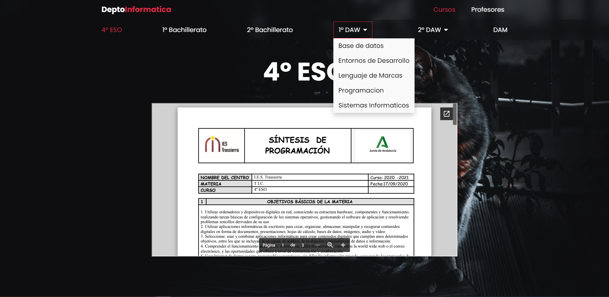

# DeptoInformatica


## Table of Content:

- [About The App](#about-the-app)
- [Screenshots](#screenshots)
- [Technologies](#technologies)
- [Setup](#setup)
- [License](#license)

## About The App
[DeptoInformatica] It is an application for the IT department, where the content is dynamically generated from the json data, with the following format:
```js
{
    title: '4º ESO',
    url: '/curso/4eso',
    file: 'https://drive.google.com/file/d/sdfgsdfg',   
},
{
    title: '1º DAW',
    url: '/curso/1daw',
    asignaturas: [
        {
            title: 'Base de datos',
            url: '/curso/1daw/base-datos',
            file: 'https://drive.google.com/file/d/dfgdfgh',
        },
        {
            title: 'Entornos de Desarrollo',
            url: '/curso/1daw/ent-des',
            file: 'https://drive.google.com/file/d/dfgdfgdfg',
        },
    ]
},
```

## Screenshots



## Technologies
I used `html`, `css modules`, `jsx`

## Setup
- Download or clone the repository
- run `npm install`
- run `npm dev` for dev mode
- The production mode is automatically displayed in [vercel](https://vercel.com) for free


## License

MIT license